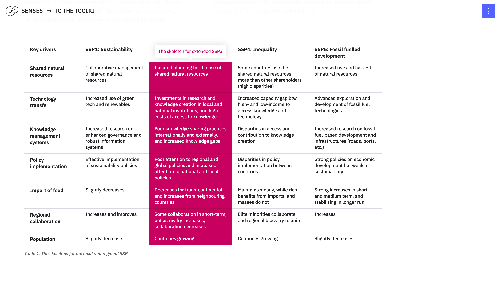
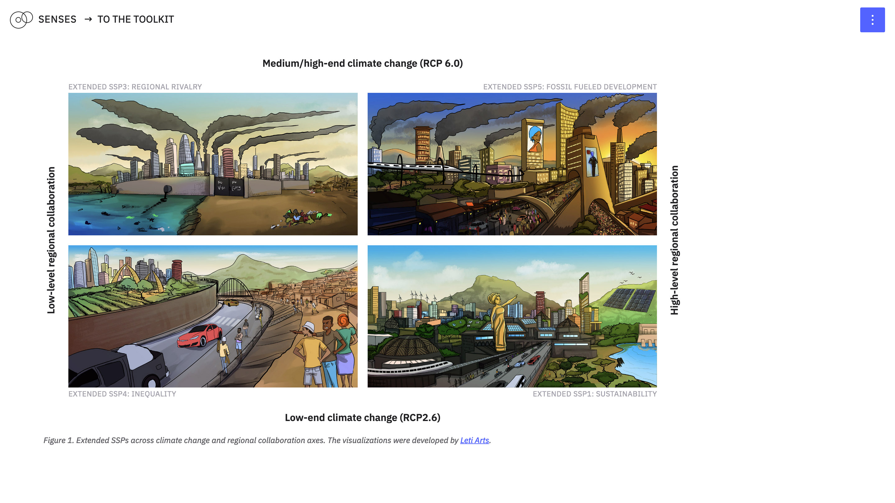
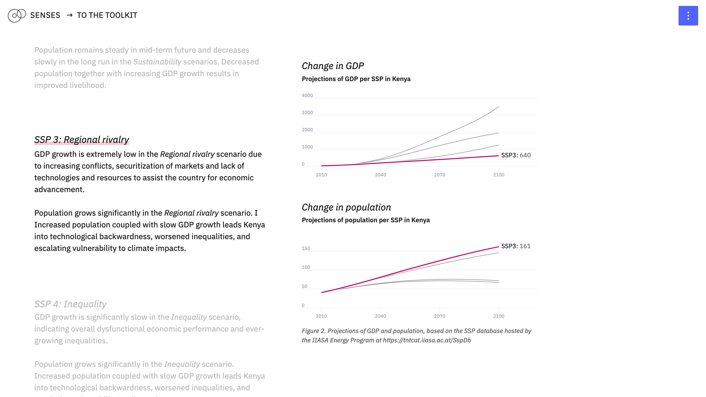
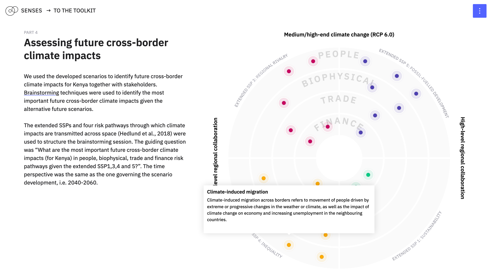

# Co-producing adaptation options to address future cross-border climate impacts

Sara Talebian, Henrik Carlsen, Oliver Johnson, Jan Volkholz, Elvine Kwamboka and Jonas Parnow

In this case study, we develop and use a set of stakeholder-driven sub-global scenarios linked to the global climate scenario architecture, especially the Shared Socioeconomic Pathways (SSPs) to explore future cross-border climate impacts and adaptation options in Kenya. Co-production techniques are used throughout the process for developing scenarios and using them for impact assessment and adaptation planning.

---

This repository contains the code for [*Co-producing adaptation options to address future cross-border climate impacts*](https://climatescenarios.org/kenya/). It is part of the [SENSES Toolkit](https://climatescenarios.org/).






## License

The source code is licensed under the [ISC license](LICENSE.md). Text and graphics are licensed under [Attribution-ShareAlike 4.0 International](https://creativecommons.org/licenses/by-sa/4.0/). For licensing information on datasets please refer to the data sources section. Exceptions are listed below on a per-file basis.

## Data Sources

Data sources and if applicable licenses are listed below on a per-file basis.

- `components/TableSSPDriver.vue` [Sara Talebian, Henrik Carlsen (2020): Case study results, future socioeconomic drivers, and states](data/Excel file 1 - case study results, future socioeconomic drivers, and states (Figure 1 & 2).xlsx)
- `store/modules/impacts.js` [Sara Talebian, Henrik Carlsen (2020): Case study results, future cross-border climate impacts](data/Excel file 2 - case study results, future cross-border climate impacts (Figure 5).xlsx)
- `components/Section-Adaptation.vue` [Sara Talebian, Henrik Carlsen (2020): Case study results, adaptation options](data/Excel file 3 - case study results, adaptation options (Table 1. Key areas of adaptation).xlsx)
- `store/modules/driver.js` Source: [SSP Database](https://tntcat.iiasa.ac.at/SspDb/); [License for the SSP database hosted by IIASA](https://tntcat.iiasa.ac.at/SspDb/dsd?Action=htmlpage&page=80)
- `store/modules/time.js` Source: [ISIMIP Database](https://data.isimip.org/); [License for the ISIMIP scenario data](https://www.isimip.org/gettingstarted/terms-of-use/licenses-publicly-available-isimip-data/)

## Build Setup

```bash
# install dependencies
$ npm install

# serve with hot reload at localhost:3000
$ npm run dev

# build for production and launch server
$ npm run build
$ npm run start

# generate static project
$ npm run generate
```

For detailed explanation on how things work, check out [Nuxt.js docs](https://nuxtjs.org).
